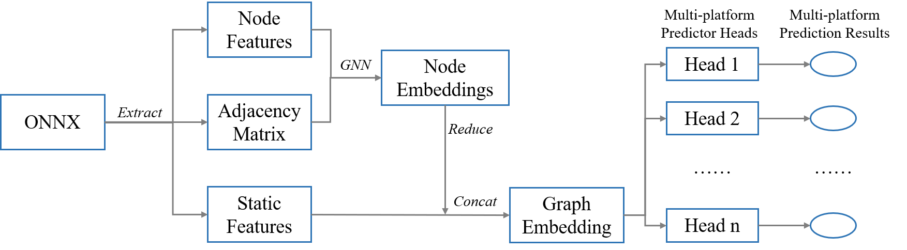
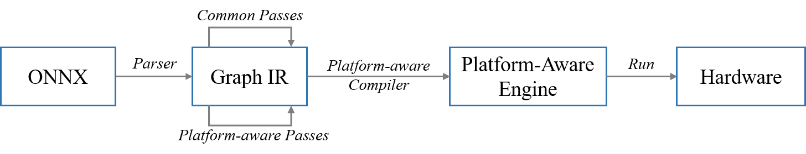

# NNLQP

NNLQP: A Multi-Platform Neural Network Latency Query and Prediction System with An Evolving Database

## Installation

#### Environment
  * `Ubuntu 16.04`
  * `python 3.6.4`

#### Install pytorch onnx networkx
  * `pytorch==1.5.0`
  * `onnx==1.7.0`
  * `networkx==2.5.1`
```shell
pip3 install -r requirements.txt
```

#### Install torch-geometric
Please refer the [torch-geometric official documentation](https://pytorch-geometric.readthedocs.io/en/latest/notes/installation.html)


#### Run Demo
Clone the repository
```shell
git clone https://github.com/anonymousnnlqp/NNLQP.git
```

Given an onnx model as input, the demo can predict model latencies on 9 platforms:
```shell
cd NNLQP
python3 demo.py --onnx_file test_onnx/resnet18-v1-7-no-weight.onnx
```

Output:
```text
Read Onnx: test_onnx/resnet18-v1-7-no-weight.onnx
Model inference cost: 44.1431999206543 ms
Latency prediction for platform cpu-openppl-fp32 : 386.098876953125 ms
Latency prediction for platform hi3559A-nnie11-int8 : 62.860267639160156 ms
Latency prediction for platform gpu-T4-trt7.1-fp32 : 7.964828014373779 ms
Latency prediction for platform gpu-T4-trt7.1-int8 : 1.4778786897659302 ms
Latency prediction for platform gpu-P4-trt7.1-fp32 : 9.099410057067871 ms
Latency prediction for platform gpu-P4-trt7.1-int8 : 3.7260262966156006 ms
Latency prediction for platform hi3519A-nnie12-int8 : 61.44997787475586 ms
Latency prediction for platform atlas300-acl-fp16 : 9.21658992767334 ms
Latency prediction for platform mul270-neuware-int8 : 18.250690460205078 ms
```

## Dataset

#### Download
```shell
cd NNLQP
mkdir dataset
wget https://github.com/anonymousnnlqp/NNLQP/releases/download/v1.0-data/dataset.tar.gz -O dataset.tar.gz
tar -xzvf dataset.tar.gz -C dataset
```
#### Format
The latency dataset is saved to directory `nnlqp/dataset`:
```text
└── dataset
    ├── multi_platform
    │   ├── gt.txt
    │   └── onnx
    │       ├── ...
    │       ├── ...
    └── unseen_structure
        ├── gt.txt
        └── onnx
            ├── ...
            ├── ...
```

`onnx` is the directory of onnx models, which are removed weights.
`gt.txt` is the latency ground-truth file, each line of the file is format as:

```text
${GraphID} ${OnnxPath} ${BatchSize} ${Latency}(ms) ${ModelType} ${PlatformId} [${Stage}](train/test)
```

The `gt.txt` file can like:
```text
553312 onnx/nnmeter_alexnet/nnmeter_alexnet_transform_0130.onnx 8 90.88183 alexnet 2 train
559608 onnx/nnmeter_alexnet/nnmeter_alexnet_transform_0157.onnx 8 11.1463 alexnet 23 train
549409 onnx/nnmeter_alexnet/nnmeter_alexnet_transform_0197.onnx 8 64.11547 alexnet 16 test
...
```
#### Overview
The datasets contains two parts: `unseen strucutre` and `multi platform`.
We will constantly add new structures and platforms to the dataset.
##### Unseen Structure
  * Platforms
    * `gpu-gtx1660-trt7.1-fp32`
  * Onnx models (2000 * 10)
    * [x] ResNets
    * [x] VGGs
    * [x] EfficientNets
    * [x] MobileNetV2s
    * [x] MobileNetV3s
    * [x] MnasNets
    * [x] AlexNets
    * [x] SqueezeNets
    * [x] GoogleNets
    * [x] NasBench201s
    * [ ] VisionTransformers
  * Input sizes
    * `1 x 3 x 32 x 32` (only for NasBenc201s)
    * `1 x 3 x 224 x224`
  * Latency samples
    * 20000

##### Multi Platform
  * Platforms
    * [x] cpu-openppl-fp32 (CPU)
    * [x] hi3559A-nnie11-int8 (NPU)
    * [x] gpu-T4-trt7.1-fp32 (GPU)
    * [x] gpu-T4-trt7.1-int8 (GPU)
    * [x] gpu-P4-trt7.1-fp32 (GPU)
    * [x] gpu-P4-trt7.1-int8 (GPU)
    * [x] hi3519A-nnie12-int8 (NPU)
    * [x] atlas300-acl-fp16 (NPU)
    * [x] mul270-neuware-int8 (NPU)
    * [ ] hexagonDSP-snpe-int8 (DSP)
    * [ ] Xilinx-Ultra96-VitisAI-int8 (FPGA)
  * Onnx models (200 * 10)
    * ResNets
    * VGGs
    * EfficientNets
    * MobileNetV2s
    * MobileNetV3s
    * MnasNets
    * AlexNets
    * SqueezeNets
    * GoogleNets
    * NasBench201s
  * Input sizes
    * `8 x 3 x 32 x 32` (only for NasBenc201s)
    * `8 x 3 x 224 x224`
  * Latency samples
    * 10597

## Experiments
#### GNN Prediction Pipeline


#### Unseen Structure
We use a certain model type for test, and use other types for training. The user can specify the test model type by specifying the `TEST_MODEL_TYPE` in the script.

Before experiments, please make sure that you download the dataset, and the directory `nnlqp/dataset/unseen_structure/` are valid.

```shell
cd NNLQP/experiments/unseen_structure/
```

* Get our pre-trained models and test
```shell
wegt https://github.com/anonymousnnlqp/NNLQP/releases/download/v1.0-data/unseen_structure_ckpt.tar.gz -O unseen_structure_ckpt.tar.gz
tar -xzvf unseen_structure_ckpt.tar.gz
bash test.sh
```

* Train from the beginning
```shell
bash train.sh
```

#### Multi Platform

Before experiments, please make sure that you download the dataset, and the directory `nnlqp/dataset/multi_platform/` are valid.

```shell
cd NNLQP/experiments/multi_platform/
```

* Get our pre-trained models and test
```shell
wget https://github.com/anonymousnnlqp/NNLQP/releases/download/v1.0-data/multi_platform_ckpt.tar.gz -O multi_platform_ckpt.tar.gz
tar -xzvf multi_platform_ckpt.tar.gz
bash test.sh
```

* Train from the beginning
Users can change `--multi_plt=1,3,4` to train a predictor that predicts latency for platforms 1, 3, 4 at the same time. The platform id should have appeared in the file `gt.txt`

```shell
bash train.sh
```

#### Transfer Platform

If there are latency samples on 4 platforms A, B, C, D, we can first train a pre-trained model that predicts latency on platforms A, B, C. Then we can adopt the pre-trained model to initialize weights, and use a small count of latency samples to train a predictor fo platform D. The knowledge of the model structure learned by the predictor for platforms A, B, C can be transferred to platform D.

For example, the `multi platforms` dataset involved 9 platforms, we can train a pre-trained model on 8 platforms 2, 9, 12, 13, 14, 16, 18, 23, and then use a certain number of samples to train predictor of platform 10. Users can set `TRAIN_NUM` in `raw_train.sh` or `transfer_train.sh` to control the samples numbers. In this example, we use `32`, `100`, `200`, `300`, `-1 (all)`. `raw_train.sh` is for training a predictor without the pre-trained model and transfer learning, while `transfer_train.sh` uses the pre-trained model and transfer learning.

```shell
cd NNLQP/experiments/transfer_platform/
```

* Users can test the results of trained predictors:
```shell
wget https://github.com/anonymousnnlqp/NNLQP/releases/download/v1.0-data/transfer_platform_ckpt.tar.gz -O transfer_platform_ckpt.tar.gz
tar -xzvf transfer_platform_ckpt.tar.gz
bash raw_test.sh
bash transfer_test.sh
```

* Or just train from the beginning:
```shell
bash raw_train.sh
bash transfer_train.sh
```

#### Custom Predictor

First, users should prepare the latency dataset with [the same format as our dataset](#format).

Then you can train your own latency predictor in two different ways:

* Train from the beginning:
  * refer the script `nnlqp/unseen_structure/train.sh`

* Transfer from our pre-trained model (more suitable for a small count of latency samples)
  * refer the script `nnlqp/transfer_platform/transfer_train.sh`


## Latency Measurement

#### How to convert ONNX into hardware format
To facilitate the latency measurement of multiple platforms, we developed a unified model deployment tool. Its pipeline is shown as below:


Given the ONNX, hardware, software, batch size, data type as input, the tool does:

  1. Converts ONNX to our unified graph intermediate representation (graph IR), which describes operator attributes and operator connection relationships;

  2. Does some common passes to transform and verify the graph IR, such as inferring shapes and folding constant;

  3. According to the query software and hardware, does some platform-aware passes so that transformed graph IR conforms to the inference constraints. For example:

      * For `data_type=int8`, it is necessary to do the quantization pass;
      * For `software=openppl`, we need to call some operator-altering passes, such as transforming Add, Sub, Mul, and Div to Eltwise;
      * For `software=trt7.1`, we need to call the operator fusion pass.
      * In addition, we provide a large number of operators with the default CPU implementation. For some operators that are not supported by the platform, the tool will split the graph IR and make these operators run on the CPU. The strategy can make sure that most models can be deployed on multiple platforms smoothly;

  4. Adopts platform-aware compilation tools to compile the graph IR into executable engines that can run on hardware.

  5. The tool manages multiple hardware devices. It can acquire access to a specific device based on the latency measurement request, and upload the engine and inference environment to the target machine by the RPC. Then it does the model inference and return latency results.

#### Device Setup
Our latency measurement tool supports the following platforms, and the platform count is continuously growing.

| type | hardware   | software |manufacturer| GFLOPS | GOPS | power |
| :--: | :---------:| :------: | :------: | :----: | :--: | :----:|
| GPU  | GTX-1660   | TensorRT-7.1|Nvidia |
| CPU  | Intel-Xeon-Gold-6246| OpenPPL  |Intel     |  |  | 165W|
| NPU  | Hi3559A    | NNIE11   |Hisilicon |
| GPU  | Tesla-T4   | TensorRT-7.1|Nvidia |
| GPU  | Tesla-P4   | TensorRT-7.1|Nvidia |
| NPU  | Hi3519     | NNIE12   |Hisilicon |
| NPU  | Atlas300   | ACL      |Huawei    |
| NPU  | MLU270     | Neuware  |Cambricon |
| *DSP | hexagonDSP | SNPE     |Qualcomm  |
| *FPGA| Xilinx-Ultra96|VitisAI|Xilinx |

(* means to be supported soon)

The latency measurement and query database are currently not open-sourced. Shortly, we will provide external services for everyone to use.


## Extra Note

#### User Case

Let’s take the face unlock model for mobile phones as an example.  For developers of deep learning application algorithms on a mobile phone, they intend to run on multiple devices such as Apple and Samsung and so on. These mobile phones also have different chips, such as Apple A, Qualcomm Snapdragon, MTK. Even for Qualcomm chips, there are four different types ARM/GPU/DSP/NPU. If the inference latency of the face unlocking model is required to be within 0.1s, we need to design a model to meet the latency requirements and decide what kind of device can be used. The accurate and true latency feedback is essential for model design and deployment. Therefore, the developer can use our system to alleviate the cost of model latency acquisition from two aspects: latency query and latency prediction. More specifically, we have following cases which can help with machine learning model design and improvement.

* NNLQ can free researchers from the tedious process of collecting the latency of DNN models from various hardware devices: While adapting to different hardware, we need to deploy models on different platforms and get true latency feedback.  For example, we can use TensorRT to get the latency feedback on NVIDIA GPU, while we cannot use TensorRT to transform model into hardware format for other hardware devices. Most hardware has different deploying format. Therefore, the proposed model latency query system NNLQ can perform automatic model deployment and latency measurement on multiple platforms. ONNX model and target platform are provided as query input, and NNLQ returns the realistic model latency on the target hardware through the three steps: model transformation, device acquisition and latency measurement.

* In the model design, our model latency acquisition system can provide some **high-level decision**:

  * Which operators are not suitable for ability: for example, hard swish is not supported on openppl. Therefore we should avoid using this operation.
  * On the choice of backbone to achieve better latency-accuracy tradeoff: For example, RegNetX-200M ResNet18  have similar ImageNet accuracy which is 68.7 and 70.3, but the latency of RegNetX-200M is 150% of ResNet18 on P4 int8, therefore, we should choose ResNet18 compared with RegNetX-200M.
  * In the choice of hardware for inference speedup: Given the same model-ResNet 18 + data type int8 + batch size 1, the latency on P4 is 2 times of the latency on T4. If these two devices are available, changing deployed device from P4 to T4 can bring 50% speedup. Besides, atlas300 is faster than mlu270 under the same setting.
  * In the choice of data type for possible accuracy degradation: for the vision transformer models, the speed up brought by int8 compared with FP32 is less than 5%. To avoid the potential accuracy degradation, you can choose to fp32 data type directly.

* In the network architecture search process, our model latency prediction can help to improve search cost and find models with higher task accuracy. If the current model is not able to be deployed on some required hardware, we need to redesign a model which is general across different platforms. Hardware-aware Network Architecture Search(NAS) is an effective method to improve the model performance. In hardware-aware NAS, models are selected with the help of hardware feedback, therefore, if the hardware feedback takes long time to be acquired, this could increase the search cost and hinder the use of hardware-aware NAS. 
    
  * NAS needs to test a large number of models, and true latency measurement is very slow. Our latency prediction is able to predict true model latency with 1000 times improved efficiency as shown in Table 2. 
    
  * Developers can further use the data from our evolving database to reduce the cost of latency predictor training. Because the prediction process brings a possible gap in the true latency and predicted latency. Improving the performance of the latency prediction allows us to simulate the true latency feedback as accurately as possible. The comparison of time cost is as follows in the table.

|      | measurement| prediction| test models | time cost |
| :--: | :---------:| :-------: | :----: | :--: |
| measurement | 1k | 0 | 1k | (1m + 0) * T |
| without transfer | 1k | 10k | 10k | (1m+10k) * T
| with transfer | 50 | 10k | 10k | (50k+10k) * T |

(k=1,000, m=1,000,000, T=once prediction cost, 1000T=once true latency test cost)

If the training cost of the predictor is high, we may not achieve the purpose of improving efficiency, but if we use historical information with our evolving database, we can get the highly accurate latency predictor with less cost, while getting more model speed. 

## Extend to a new type of architecture

* Generate the required ONNX model, we can produce 2k to server as the training and validation samples for latency prediction with 1k for both sides. 
* Using NNLQ to get the true speed of the model, we don’t need to convert to a hardware-specific format by ourselves, reducing the cost of speed measurement
* In fact, we are able to predict latency with our pre-trained predictor if this hardware is already trained once. However, to improve accuracy, we also need to select some samples to finetune this predictor.
* Select the samples required to train the latency predictor. With the help of historical latency information or trained hardware predictors, we are able to perform fast finetuning to obtain a high-precision latency predictor model. In our extension experiments with Vision Transformer, we find that only 50 samples are needed to get a high-precision speed predictor and are compared with the results of 1000 samples.

|      | MAPE| RMSPE| ErrBound(0.1) | time cost |
| :--: | :---------:| :-------: | :----: | :--: |
|1000 samples without pretrain | 0.01022 | 0.01367 | 0.999 | (1m + 1k) * T |
|50 samples with pretrain | 0.00977 | 0.01315 | 0.999 | (50k + 1k) * T |

(k=1,000, m=1,000,000, T=once prediction cost, 1000T=once true latency test cost)

## How does this help to NAS

* From a theoretical analysis perspective, we have a much higher possibility for find models which meets the latency requirements.
    
  * Given the latency requirement of the model (e.g., 5ms), the improvement of the latency predictor acc can increase the probability of finding a model that meets the latency requirements. For example, with the true latency feedback, we are only able to test 1k models, but with the latency predictor, we are allowed to get the latency of 1w models. With the help of an accurate latency predictor, we guarantee that the prediction error is less than 10% for 95% of models. Therefore, we can get more models that meet the latency requirements, which will lead to an increased probability of finding a higher-precision model.
    

* With the help of an accurate latency predictor and accurate accuracy predictor, we are able to find models with higher task accuracy. 
    
  * In Section 8.7, we give an example that how does latency prediction helps find more accurate models compared with FLOPs, lookup table, predict latency and true latency. With more accurate latency feedback, we are able to produce models with 1.2% higher task accuracy.

## License
NNLQP is licensed under the [Apache-2.0](LICENSE) license.